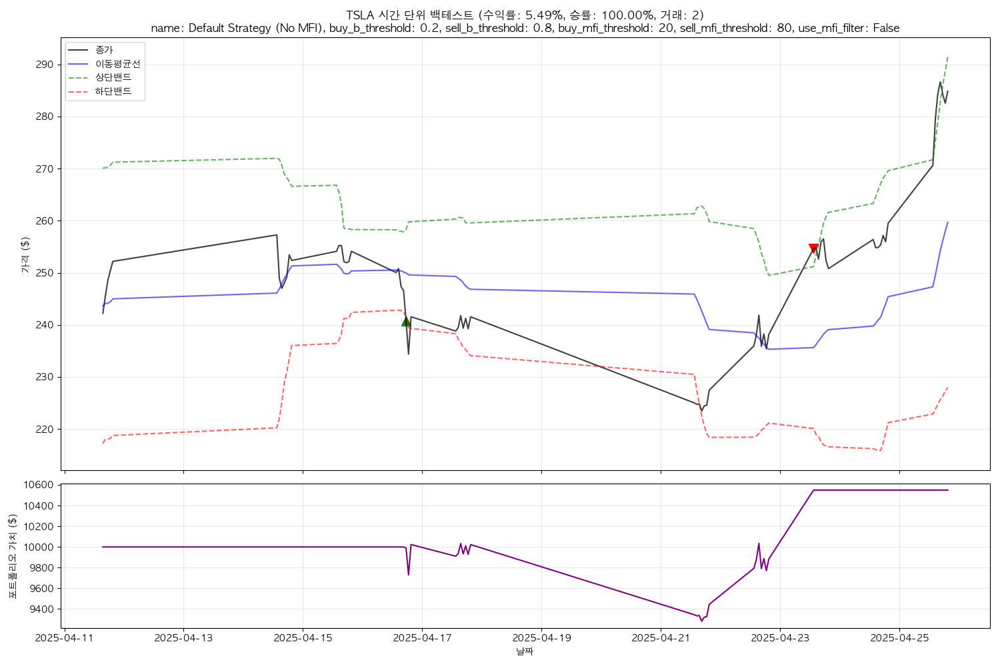
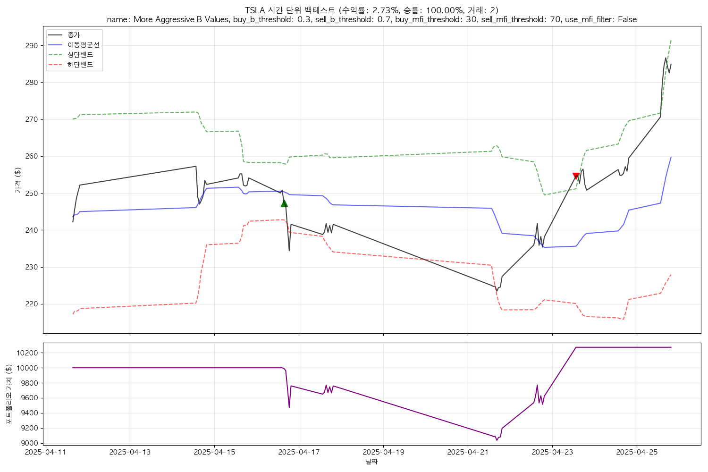
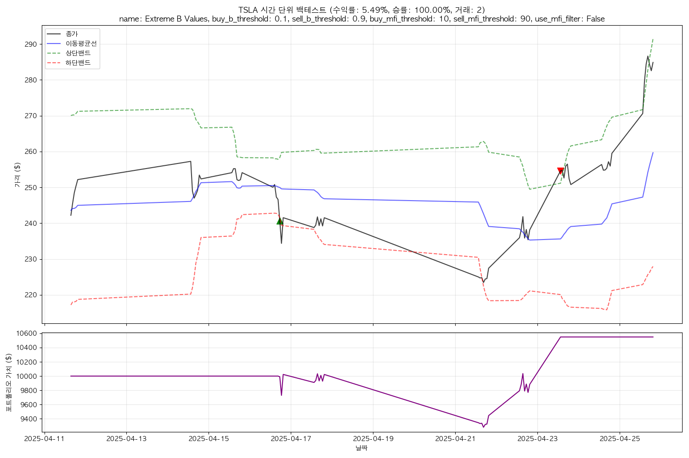

# TSLA 시간 단위 백테스트 결과 요약

백테스트 기간: 2025-03-29 ~ 2025-04-28
데이터 포인트: 68개

## 전략별 성과

| 순위 | 전략 | 총 수익률 | 최대 낙폭 | 거래 횟수 | 승률 | 최종 자산 |
|------|------|-----------|-----------|-----------|------|----------|
| 1 | Default Strategy (No MFI) | 5.49% | 7.49% | 2 | 100.00% | $10549.38 |
| 2 | Extreme B Values | 5.49% | 7.49% | 2 | 100.00% | $10549.38 |
| 3 | More Aggressive B Values | 2.73% | 9.64% | 2 | 100.00% | $10272.72 |

## 최적 전략 파라미터

- **name**: Default Strategy (No MFI)
- **buy_b_threshold**: 0.2
- **sell_b_threshold**: 0.8
- **buy_mfi_threshold**: 20
- **sell_mfi_threshold**: 80
- **use_mfi_filter**: False

## 거래 기록

| 날짜 | 유형 | 가격 | 수량 | 거래액 |
|------|------|------|------|--------|
| 2025-04-16 17:30 | 매수 | $240.74 | 41 | $9870.34 |
| 2025-04-23 13:30 | 매도 | $254.63 | 41 | $10440.03 |

## 모든 전략의 차트

### Default Strategy (No MFI)

### More Aggressive B Values

### Extreme B Values

