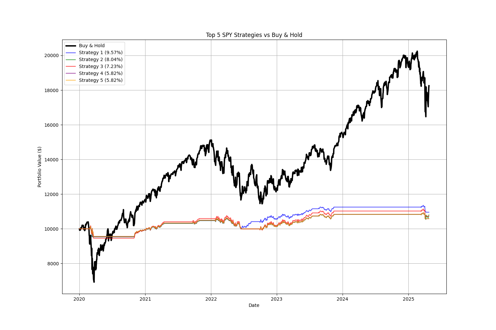
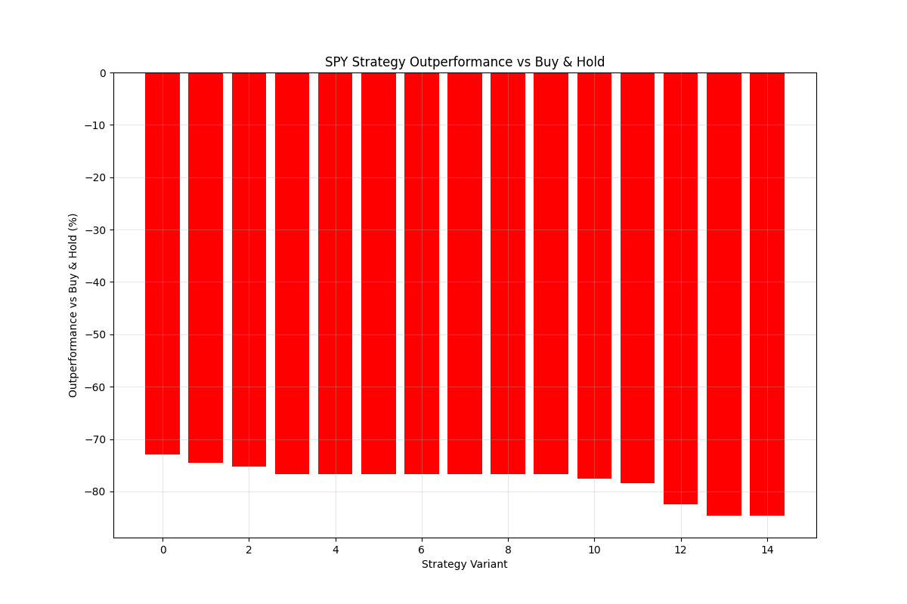

# SPY 볼린저 밴드 전략 백테스트 결과 분석

## 개요

이 문서는 SPY (S&P 500 ETF)에 대해 다양한 볼린저 밴드 전략 옵션을 백테스트한 결과를 요약합니다. 테스트 기간은 2020년 1월 1일부터 현재까지이며, 각 전략은 Buy & Hold 전략과 비교 분석되었습니다.

## 테스트 조건

- **초기 자본금**: $10,000
- **거래 수수료**: 0.1% (매수/매도 시)
- **테스트 기간**: 2020-01-01 ~ 현재
- **기준 지표**: 볼린저 밴드 (%B), MFI (Money Flow Index)

## Buy & Hold 결과

| 지표 | 수치 |
|------|------|
| 총 수익률 | 82.52% |
| 연간 수익률 | 11.99% |
| 최대 낙폭 | 33.46% |
| 최종 자산 가치 | $18,251.59 |

## 볼린저 밴드 기반 전략 TOP 5 성능

| 순위 | 총 수익률 | Buy & Hold 대비 | 연간 수익률 | 최대 낙폭 | 최종 자산 | 주요 파라미터 |
|------|----------|----------------|----------|---------|-----------|-------------|
| 1 | 9.57% | -72.95% | 1.74% | 6.01% | $10,956.72 | 트랜치: 3, 손절: 10%, 리스크: medium |
| 2 | 8.04% | -74.48% | 1.47% | 6.49% | $10,803.74 | 트랜치: 3, 손절: 15%, 리스크: medium |
| 3 | 7.23% | -75.28% | 1.32% | 7.79% | $10,723.48 | 트랜치: 3, 손절: 7%, 리스크: high |
| 4 | 5.82% | -76.69% | 1.07% | 6.58% | $10,582.48 | 트랜치: 3, 손절: 7%, 리스크: medium |
| 5 | 5.82% | -76.69% | 1.07% | 6.58% | $10,582.48 | 트랜치: 1, 손절: 7%, 리스크: medium |

## 파라미터 영향 분석

### 손절매 비율
- **손절매 10%**: 9.57% 수익 (최고 성능)
- **손절매 15%**: 8.04% 수익 (2위)
- **손절매 7%**: 5.82% 수익 (기본)
- **손절매 5%**: 4.96% 수익
- **분석**: 손절매 비율이 높을수록 더 나은 성과를 보임 (7% → 10% → 15%)

### 리스크 수준
- **High**: 7.23% 수익 (3위)
- **Medium**: 5.82% 수익 (기본)
- **Low**: 4.07% 수익
- **분석**: 리스크 수준을 높일수록 성과 개선, 자본 활용도 증가 효과

### 트랜치 (분할매수)
- **트랜치 1-5**: 대부분 비슷한 성과 (특정 파라미터 조합에서)
- **분석**: 일부 설정에서는 트랜치 수가 큰 영향을 미치지 않음, 단 초기 진입 타이밍이 더 중요할 수 있음

### 기타 파라미터
- **밴드 타기 (Band Riding)**: -2.06% 수익 (손실 발생)
- **MFI 임계값 (30/70)**: -2.04% 수익 (손실 발생)
- **MFI 임계값 (10/90)**: 0.0% 수익 (거래 없음)
- **%B 임계값 (0.1/0.9 또는 0.3/0.7)**: 기본 설정과 동일한 성과

## 주요 발견점

1. **장기 상승장에서의 Buy & Hold 우위성**:
   - 테스트 기간 동안 Buy & Hold 전략(82.52%)이 모든 볼린저 밴드 전략보다 훨씬 높은 수익률 기록
   - Buy & Hold 대비 최고 성능 전략도 -72.95% 낮은 성과

2. **낮은 최대 낙폭 (Maximum Drawdown)**:
   - 볼린저 밴드 전략의 주요 장점은 낮은 최대 낙폭 (6.01% vs Buy & Hold의 33.46%)
   - 변동성 감소 효과로 리스크 관리에 유리

3. **손절매 비율과 리스크 설정의 중요성**:
   - 손절매 비율을 높이고 (10-15%) 리스크 수준을 높게 설정할 때 가장 좋은 성과
   - 매매 리스크와 수익률 사이의 균형점 고려 필요

4. **거래 패턴 분석**:
   - 최고 성능 전략들은 13-18번의 거래 수행
   - 거래 횟수 33번인 전략들은 과도한 거래 비용으로 손실 발생

## 결론 및 제언

1. **적합한 시장 환경**:
   - 볼린저 밴드 전략은 상승장보다 횡보장이나 변동성 높은 시장에서 더 효과적
   - 장기 상승장에서는 Buy & Hold가 단연 우수

2. **리스크 관리 측면의 장점**:
   - 최대 낙폭이 크게 감소하여 심리적 안정성 제공
   - 시장 급락 시 포트폴리오 보호 효과 기대

3. **추가 테스트 제안**:
   - 하락장 또는 횡보장 기간에 대한 별도 백테스트 권장
   - 다양한 자산 클래스에 대한 테스트로 전략 범용성 검증 필요
   - 복합 지표 활용 및 기계학습 기반 매매 신호 고려

4. **실전 적용 시 고려사항**:
   - 상승장에서는 Buy & Hold 또는 더 공격적인 설정 권장
   - 하락장/횡보장 진입 시 볼린저 밴드 전략으로 전환 고려
   - 손절매 비율 10-15% 및 높은 리스크 설정이 유리

 